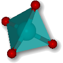

#  **atomes: tutorials**

## Welcome to the tutorials of the **atomes** program

[atomes][atomes] is a cross-platform Free (Open Source) software.  
It is developped by [Dr. Sébastien Le Roux][slr], research engineer for the [CNRS][cnrs]

  

[Dr. Sébastien Le Roux][slr] works at the Institut de Physique et Chimie des Matériaux de Strasbourg [IPCMS][ipcms]

  

This website presents the user tutorials for the **atomes** program.

This website is hosted on [GitHub][github] and was created using [Jekyll][jekyll]. 

You can download the complete tutorials in PDF here: [atomes tutorials PDF][atomes-tuto]

## atomes: user manual

You can also check the **atomes** documentation:

- [atomes: user manual][atomes-doc]

## License

This work is licensed under a <a rel="license" href="http://creativecommons.org/licenses/by/4.0/">Creative Commons Attribution 4.0 International License</a>&nbsp;&nbsp;<a rel="license" href="http://creativecommons.org/licenses/by/4.0/">

[slr]:https://www.ipcms.fr/sebastien-le-roux/
[cnrs]:https://www.cnrs.fr/
[ipcms]:https://www.ipcms.fr/
[github]:https://github.com/
[jekyll]:https://jekyllrb.com/
[atomes]:https://atomes.ipcms.fr/
[atomes-tuto]:atomes-tutorials.pdf
[atomes-doc]:/atomes-doc
